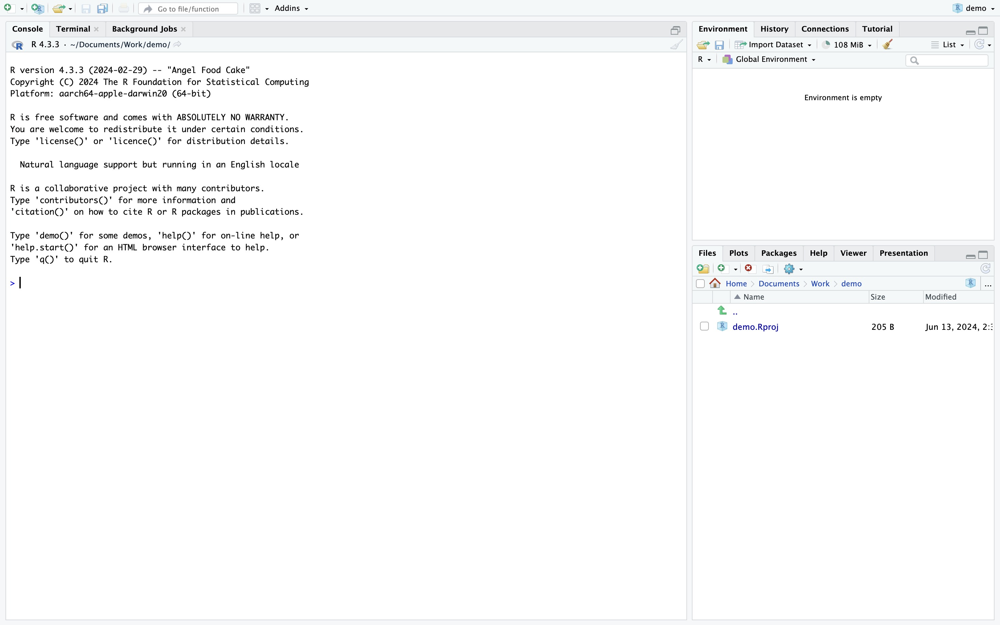

# Analysis of RNA Sequencing Data Using CLC Genomics Workbench and R: An Example of Identifying genetic expressions and variations in comparative experiments

## introduction

## preparation

### dataset

#### objective and background

#### gene types and treatments

#### organization of files and nomination

### CLC workbench

#### requirements

#### download

#### plugin installation

#### Licenses

#### CLCBio Genomics Workbench Server

### IPA

#### requirements

#### download

#### Licenses

### R

#### requirements
* Operating System: R can be installed on Windows, macOS, and Linux platforms.
*	Hardware Requirements: No specific hardware requirements. Performance improves with better hardware.
* Memory Requirements: 2 GB of RAM minimum recommended, 4 GB of RAM recommended for handling larger datasets.

#### download
To use R for data analysis, you will need to install both R and RStudio, a popular Integrated Development Environment (IDE) that makes using R easier. download, installation instruction can be found:https://posit.co/download/rstudio-desktop/

#### package installation
R packages are collections of functions and data sets developed by the community that enhance R’s functionality, allowing you to perform additional types of analysis or improve ease of use. For example, ```ggplot2``` enhances graphical capabilities, ```dplyr``` offers advanced data manipulation, and tidyr helps in organizing data. 


Installing packages in R is straightforward:
* 


#### Licenses

## Method

### RNA Sequencing Data Analysis Workflow

### Data preprocessing

#### Import FASTQ Reads to CLC Genomics Workbench

#### Quality Control of Sequencing Reads

#### Trim Reads

#### Import Metadata Table

#### Reads Mapping

#### Automate the process using Workflow

#### Export Data

### General downstream analysis

#### with CLC workbench

#### Create a PCA Plot

#### Differential Expression

#### Create a Heatmap

#### Create a Venn Diagram

### IPA analysis

### Customized downstream analysis with R

#### get sample codes from GitHub

#### explanation and rational of the code

#### allocate input files

#### run the code to generate desired plots

#### modify the code for customized plots

# Reference
