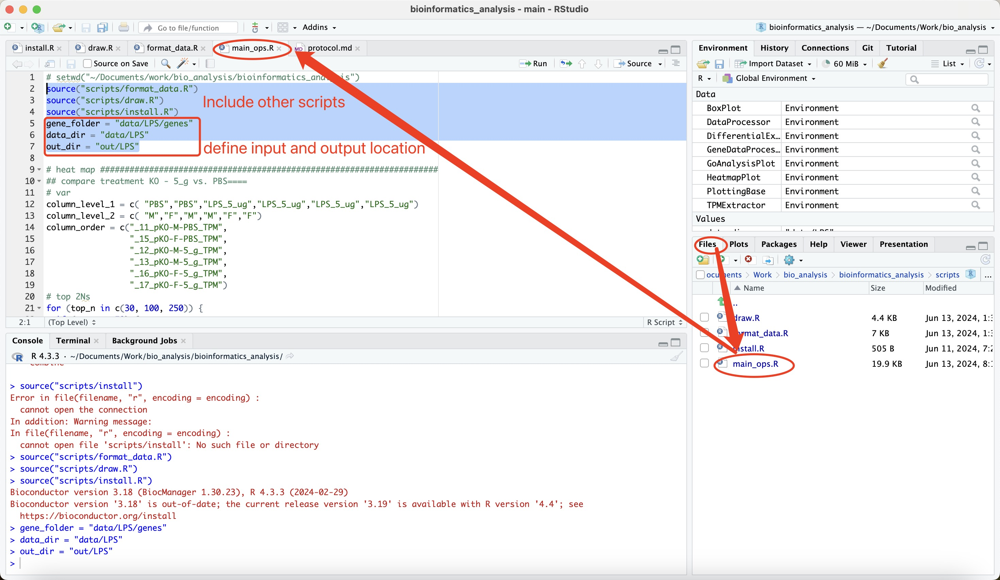
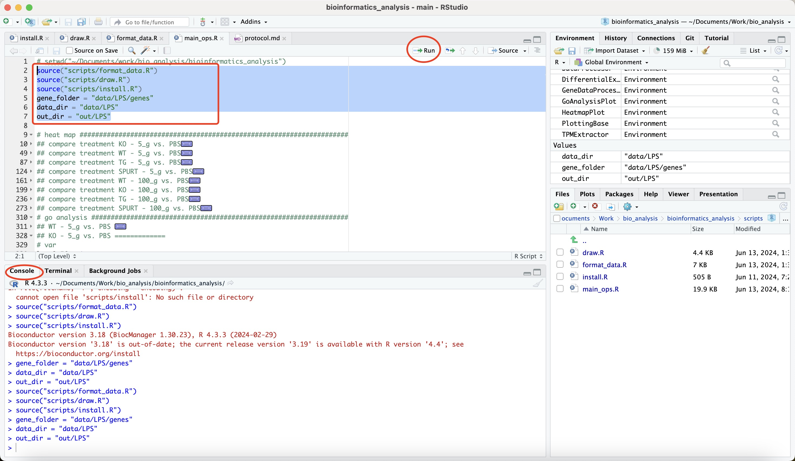
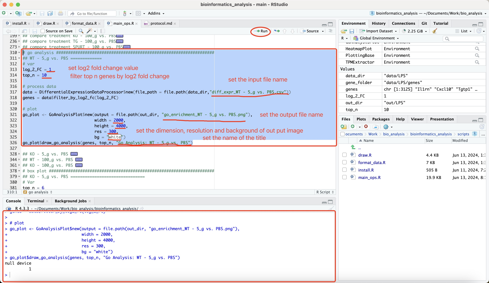
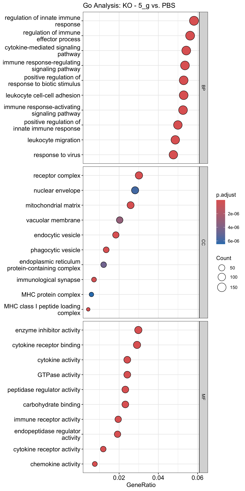

# Analysis of RNA Sequencing Data Using CLC Genomics Workbench and R: An Example of Identifying genetic expressions and variations in comparative experiments

## introduction

## preparation

### dataset

#### objective and background

#### gene types and treatments

#### organization of files and nomination

### CLC workbench

#### requirements

#### download

#### plugin installation

#### Licenses

#### CLCBio Genomics Workbench Server

### IPA

#### requirements

#### download

#### Licenses

### R

#### requirements
- Operating System: R can be installed on Windows, macOS, and Linux platforms.
- Hardware Requirements: No specific hardware requirements. Performance improves with better hardware.
- Memory Requirements: 2 GB of RAM minimum recommended, 4 GB of RAM recommended for handling larger datasets.

#### download
To use R for data analysis, you will need to install both R and RStudio, a popular Integrated Development Environment (IDE) that makes using R easier. download, installation instruction can be found:https://posit.co/download/rstudio-desktop/

#### package installation
R packages are collections of functions and data sets developed by the community that enhance R’s functionality, allowing you to perform additional types of analysis or improve ease of use. For example, ```ggplot2``` enhances graphical capabilities, ```dplyr``` offers advanced data manipulation, and tidyr helps in organizing data. 


Installing packages in R is straightforward:

- Open RStudio: After installation, open RStudio. The interface is divided into several panels:

  - Console: Where you type commands and see output.
  - Environment/History: Shows current variables in the workspace and command history.
  - Files/Plots/Packages/Help: Access to files, visual outputs, package management, and help files.
 
- Installing Packages: To install an R package, use the ```install.packages()``` function in the Console. For example:

 ```
 install.packages("ggplot2") # Installs the ggplot2 package for data visualization
 ```
- Loading Packages: After installation, load a package into your session to use its functions:

 ```
 library(ggplot2) # Loads the ggplot2 package for use
 ```

#### Licenses

R and RStudio are free software. R is released under the GNU General Public License, and RStudio comes under the Affero General Public License. These licenses allow you to use, modify, and distribute the software freely.

## Method

### RNA Sequencing Data Analysis Workflow

### Data preprocessing

#### Import FASTQ Reads to CLC Genomics Workbench

#### Quality Control of Sequencing Reads

#### Trim Reads

#### Import Metadata Table

#### Reads Mapping

#### Automate the process using Workflow

#### Export Data

### General downstream analysis

#### with CLC workbench

#### Create a PCA Plot

#### Differential Expression

#### Create a Heatmap

#### Create a Venn Diagram

### IPA analysis

### Customized downstream analysis with R

#### get sample codes from GitHub

- For users familiar with GitHub:

   Clone the Repository: To get the sample code, clone the repository from GitHub using the following command in your terminal or command prompt:
   
   ```
   git clone https://github.com/maxianren/bioinformatics_analysis.git
   ```
   
   This will create a local copy of the repository on your machine, where you can leverage the code to create your own scripts and potentially contribute updates or improvements back to the repository.

- For users who do not use GitHub:

  - Download the Code:
   
   
  - Go to https://github.com/maxianren/bioinformatics_analysis.
  - Click on the Code button and select Download ZIP.
  - Save the ZIP file to your computer and extract it to a desired location.
 

#### explanation and rational of the code
Once you have the codebase on your local machine, here’s what you will find inside:

 - Objective of the Code:
 The provided scripts are designed to perform customized data analysis on results generated from CLC Genomics Workbench. The main objectives are:
  - Data Transformation: Convert raw data into a format suitable for analysis and visualization.
  - Plot Generation: Create informative visualizations to compare treatments within the same gene type. Example plots include heatmaps for visual comparison, box plots for statistical distribution, and GO analysis for understanding gene functions and pathways.
 
 
- Folder Structure:
  - data/: This directory should contain the input data, which is generated by the CLC Workbench.
  - out/: This is where the output of the program is stored, including any plots or processed data files.
  - scripts/: Contains the R scripts used for analysis. There are four main files:
    - install.R: This script is used for installing necessary R packages.
    - data_format.R: Prepares and formats the data for analysis.
    - draw.R: Contains functions to generate plots.
    - main_ops.R: Main operations script that calls functions from other scripts to process data and generate plots.
  - bioinformatics_analysis.Rproj: An R project file that can be opened with RStudio to manage the entire project easily.


#### allocate input files
To organize your data efficiently, you may create specific folders within the data/ and out/ directories:

- Input Files:
  - Create a project-specific folder within the data/ directory. For example, for an LPS-related project, create an LPS/ folder.
  - Inside the LPS/ folder, create a genes/ subfolder to store gene data for each experimental sample.
  - Place all input files in the appropriate directories. Ensure that these files are correctly formatted and named for easy reference by the scripts.
 
- Output Files:
  - Similarly, create a corresponding project folder within the out/ directory to store all outputs generated by your analyses.
  - This organized structure helps in tracking the analysis outputs related to specific input sets and projects.
 
  
#### run the code to generate desired plots
To execute the analysis and generate plots:

- Open the Project:
  - Launch RStudio.
  - Open bioinformatics_analysis.Rproj to initiate the R project environment.
- Prepare the Scripts:
  - Open main_ops.R. This script orchestrates the workflow, calling functions from other scripts.
  - Ensure main_ops.R includes references to other necessary scripts (install.R, data_format.R, draw.R) using source() function calls.
- Set Input and Output:
  - In main_ops.R, specify paths for input data and output files.
  
  - Execute the relevant sections of the script by selecting the lines and pressing Ctrl+Enter (or Cmd+Enter on Mac). Confirm that paths and data are correctly recognized in the console output.
  
- Generate Plots:
  - The script includes commands to create box plots, perform GO analysis, and generate heatmaps.
  - For example, to perform GO analysis comparing “PBS vs 5ug LPS under WT genotype”:

      ```
      ## WT - 5_g vs. PBS =============
      # var
      log_2_FC = 1
      top_n = 10
      
      # process data
      data = DifferentialExpressionDataProcessor$new(file_path = file.path(data_dir,"diff_expr_WT - 5_g vs. PBS.csv"))
      genes = data$filter_by_log2_fc(log_2_FC)
      
      # plot
      go_plot <- GoAnalysisPlot$new(output = file.path(out_dir, "go_enrichment_WT - 5_g vs. PBS.png"), 
                                    width = 2000, 
                                    height = 4000, 
                                    res = 300, 
                                    bg = "white")
      go_plot$draw_go_analysis(genes, top_n, "Go Analysis: WT - 5_g vs. PBS")
      ```
  - Adjust the parameters as needed, select the script lines, and run them to generate and save the plot in the specified out/ directory.
  
  

#### modify the code for customized plots
To adapt the analysis for different comparisons or conditions:

- Copy and Modify the Code:
  - Duplicate the sections of the script for the analysis you wish to modify.
  - Change the input and output paths, parameter values (like log2_fc_threshold and top_n_genes), and other specific settings to match the new experimental conditions (e.g., “PBS vs 100ug LPS” or different genotypes like KO, TG, SPURT).
- Re-run the Analysis:
  - After making the necessary changes, re-run the modified sections of the code.
  - Check the out/ directory for the new plots to ensure they have been generated as expected.
  
# Reference
